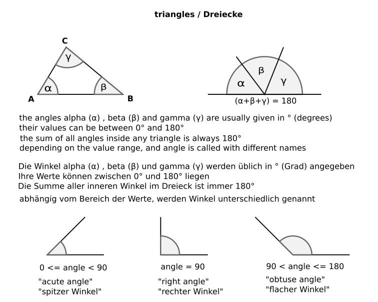

# Test - Programming Basics 

## Test Instructions 
* Work from the `index.js` file provided in this repository.
* Work in the `master` branch. Commit your changes to the `index.js` file and push them to your repository. Your answers will be automatically graded when you push to your repository. If you do not push an updated `index.js` file to the `master` branch, the automatic grading will fail.
* Follow the instructions below to complete the test. **Important**: Make sure that the *names* of your variables/functions match the names in the instructions below.
* All your functions should return a value.
* Good luck!

### Conditional Algorithms 

#### 1. Los or New?
Create a function named "_nameOfCity_". If a passed string begins with "_Los_" or "_New_", then return the full string. If not, return "_The city name does not begin with Los or New_". The function should be **case insensitive**.

##### Examples
````javascript
nameOfCity('New York') ➞ 'New York'
nameOfCity('newark') ➞ 'newark'
nameOfCity('London') ➞ 'The city name does not begin with Los or New'
````

#### 2. isDivisible?
Create a function named "_isDivisible_". The function should take an integer as an argument. If the integer is divisible by 100, then return true. If not, return false.

##### Examples
````javascript
isDivisible(1) ➞ false
isDivisible(1000) ➞ true
isDivisible(100) ➞ true
````

#### 3. Missing Angle
Create a function named "_missingAngle_" which takes two angles of a triangle as arguments, and classifies the missing angleas either acute, right or obtuse. 
**Note**: An acute angle is smaller than 90°, a right angle is exactly 90° and an obtuse angle is greater than 90°  (but less than 180°). 

##### Examples
````javascript
missingAngle(11, 20) ➞ 'obtuse' // remaining angle is 149°)
missingAngle(27, 59) ➞ 'obtuse'
missingAngle(135, 11) ➞ 'acute'
missingAngle(45, 45) ➞ 'right angle'
````




#### 4. What's the weather?
Use a **ternary operator** to complete this task. Create a function named "_isRaining_". If passed `true`, return "_wet day - you need an umbrella_". If passed `false`, return "_dry day - leave your umbrella at home_".

##### Example
````javascript
isRaining(true) ➞ 'wet day - you need an umbrella'
````

### Loops 

#### 1. Sequence
Create a function named "_geometricalSequence_" and **use a loop** to return the following sequence: _`1 2 4 8 16 32 64 128 256`_. Concatenate each value to a string and return a string.

##### Example
````javascript
geometricalSequence() ➞ '1 2 4 8 16 32 64 128 256'
````

#### 2. Multiples
Create a function named "_multiplesOfThree_" and **use a loop** to return the first five multiples of three: _`3 6 9 12 15`_. Concatenate each value to a string and return a string.

##### Example
````javascript
multiplesOfThree() ➞ '3 6 9 12 15'
````

### Math 

#### 1. You've got the power
Create a function named "_powerOf_" which takes an integer as an argument and returns the integer to the power of itself. You should **use a Math object method** to make the calculation.

##### Examples
````javascript
powerOf(3) ➞ 27
powerOf(4) ➞ 256
````

### Problem Solving 

#### 1. How many? 
Create a function named "_vowelCount_" that accepts a string as an argument. Check how many vowels (A, a, E, e, I, i, O, o, U, u) the string contains, if any. **Return the vowel count** of the string. 

##### Examples
````javascript
vowelCount("hello") ➞ 2
vowelCount("test") ➞ 1
vowelCount("fbw") ➞ 0
````
